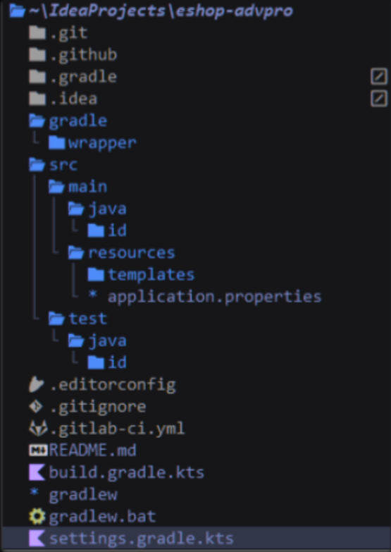
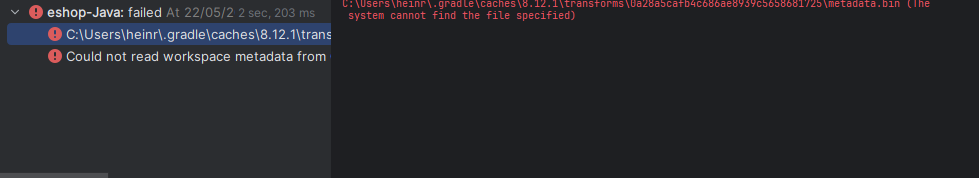
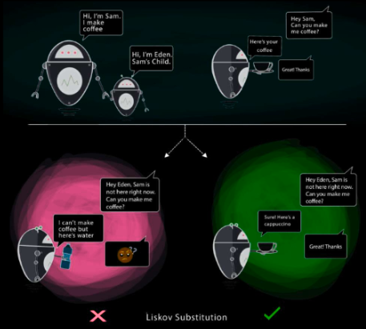
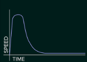

# Module 1

### 1. Tutorials Tad Confusing
- Hard to understand words 
- - Explanation :
- - - Hard to understand long sentences or paragraphs, 
- - Example :
- - - Hard to understand :
- - - - You already implemented two new features using Spring Boot. Check again your source code 
        and evaluate the coding standards that you have learned in this module.
- - - Easy to understand :
- - - - Two new features implemented using Spring Boot. Review source code, evaluate learned 
        coding standards
- - - Reason :
- - - - Too many words -> Focus directed to last word -> Previous sentences forgotten, unchecked 
        -> Reread paragraph -> Focus directed to last word -> repeat

### 11/03/2025 :
- Laptop finally back after no one knows how long.
- RAM changed and Motherboard fixed, Laptop Reset.
- Reason why took that long :
- - RAM corrupted Windows Update
- - DELL needs long test for this unique error
- - Not all error fixed, just some lightweight remaining (ie. some default apps missing and some DELL update can't)
- Noticed not all codes was updated to github after "git clone"

### Thoughts after Module 1 :
- Often confused from different naming style, but ignorable
- - Example :
- - - 
| Module            | Mine        |
|-------------------|-------------|
|ProductRepository| RepoProduct |
|ProductController|CtrlProduct|


## Reflection 1
### Clean Code How To
- Naming conventions
- Long methods avoid
- Refactor redundant code
- Understandable variable names
- Readability focus
- Comments unnecessary if names explained

## Reflection 2
### 1. Not understandable paragraph.
- Which Question, all rhetorical, All questions connected, or what??????
- Unnecessary note : Iced coffee, now warm coffee, left untouched due to confusion
### 2. #$%@&???
- uuuhhh... more structured file names... does that suffice? 2 paragraph of confusions enough....


# Module 2

## Module Questions :
- 
- - What? Did my gradle went wrong? The Project Structure is different despite following Module
- 
- - Followed Instruction yet not tasks appears
- 
- - What?
- 
- - Where????

## Reflections :
1. None? More questions than asnwers (the 4 questions above are few of many, but I'll ask the 
   main questions, not the side questions)
2. No. Many erros. Many questions (Which definition (20-21? 22? 23?)?)

# Module 3

## Page 3 :
- OOP = Object focused, Same func diff behaviour.

## Page 6 :
- Base for Object.

## Page 7 :
- Entity.

## Page 9 :
- User focused (ie. Style or output).

## Page 11 :
- Hide True key in code or main class.

## Page 13 :
- Extends main class.

## Page 15 :
- (in biology) same kingdom different species, or same species different race.
- - Example :
- - - Bubo bubo sibiricus
- - - Bubo bubo turcomanus

## Page 18 :
- Annoyance.

## Page 25 :
- Annoyance. Complicates structure (not neat if used extremely).

## Page 27 :
- Complicates updates renders structure not neat.

## Page 31 :
- 
- - Customer wants coffee, not cappuccino (coffee + steamed milk + milk foam), Thus Liskov 
    Substitution example results incorrectly (by strict coffee (noun) definition).
- Child can do parent's tasks (but by example, incorrectly).

## Page 38 :
- Annoyance, Distracts flow if project became larger (medium). ease flow if project become huge 
  (company size because too many department and sub-department)

## Page 41 :
- What? 

## Page 43 :
- Ease future updates.

## Page 48 :
- Makes sure no problem.

## Page 106 :
- SRP
- - Used (RepoProduct.java, ServiceProductImpl.java)
- OCP
- - Violated (Many changes to previous versions because errors after adding Car.java, thus after 
    Module 2)
- LSP
- - Used (Car.java and Product.java alone in CtrlProduct.java)
- ISP
- - Unused
- DIP
- - Unused
- Unfixed reason :
- - Possibly more errors for Module 4

## Comment :
- before-solid remains the same as main, branch add seems inefficient

## Reflection :
1. Technically SRP and LSP, even though instructed.
2. Let's see :
- Advantages :
- - Standardize productions.
- - LSP helps updates if base design made.
- - OCP forces developers (especially game) to rethink base.
- Disadvantages :
- - OCP often violated if updates or changes occurred (especially if base design changes after 
      new update (example: Spellsided game uses 1 box during development, after boundaries (or 
      wall) added the base changes from 1 box to 4))
3. Disadvantages are on 2nd question (this what I meant OCP hard to use personally)


# Module 4 

# Page 5 :
1. Depends :
- Base Case :
- - Raw Java
- - No Engine
- Results :
-
  | AI                  | Time | Size  |
  |---------------------|------|-------|
  | deepseek-coder-v2   | 1h   | 9gb   |
  | devstral:24b        | 1.5h | 14gb  |
  | phind-codellama:34b | 2h   | 24gb  |
  | ChatGPT4.1mini      | 3h   | 9gb   |
  | none                | 2d+  | 0gb   |

- Reason : deepseek-coder-v2 and devstral:24b code focused (especially Java), GPT4.1mini often 
  added unnecessary features and longer debug unlike deepseek-coder-v2. phind-codellama:34b on 
  par with 
  deepseek-coder-v2 but more time because more RAM usage, but stronger in Python than Java. and 
  devstral:24b right between deepseek-coder-v2 and phind-codellama:34b because of size and RAM 
  usage (quantized by Ollama).
2. Unknown.
3. Yes (Current internship)
4. Depends :

| Feature Size       | Time |
|--------------------|------|
| html only          | 30m  |
| Small easy         | 2h   |
| Small complicated  | 6h   |
| medium easy        | 3h   |
| medium complicated | 8h   |
| hard easy          | 10h  |
| hard complicated   | 18h  |
5. 

## Page 17 :
```java
// Valid
assertValid(1900);
assertValid(1901);
assertValid(1950);
assertValid(1999);
assertValid(2000);

// Invalid Low
assertInvalid(1895);
assertInvalid(1899);
assertInvalid(1899);
assertInvalid(1899);
assertInvalid(1899);

// Invalid High
assertInvalid(2001);
assertInvalid(2001);
assertInvalid(2005);
assertInvalid(2001);
assertInvalid(2001);
```

## Page 18 :
```java
///Tests (4n + 1 = 9 total)

// Month boundaries (Year fixed at 1950)
assertValid(validate(1, 1950));

assertValid(validate(2, 1950));

assertValid(validate(11, 1950));

assertValid(validate(12, 1950));

// Year boundaries (Month fixed at 6)
assertValid(validate(6, 1900));

assertValid(validate(6, 1901));

assertValid(validate(6, 1999));

assertValid(validate(6, 2000));

// Middle values
assertValid(validate(6, 1950));
```

## Page 20 :
- No, bugs or case logic may untested.

## Page 38 :
- Self thought :
- - 'what...'

## Page 88 :
- Genuinely, probably none.

