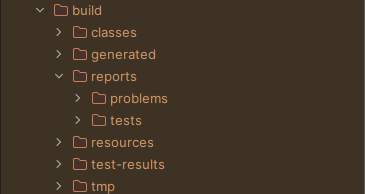

# Module 1

### 1. Tutorials Tad Confusing
- Hard to understand words 
- - Explanation :
- - - Hard to understand long sentences or paragraphs, 
- - Example :
- - - Hard to understand :
- - - - You already implemented two new features using Spring Boot. Check again your source code 
        and evaluate the coding standards that you have learned in this module.
- - - Easy to understand :
- - - - Two new features implemented using Spring Boot. Review source code, evaluate learned 
        coding standards
- - - Reason :
- - - - Too many words -> Focus directed to last word -> Previous sentences forgotten, unchecked 
        -> Reread paragraph -> Focus directed to last word -> repeat

### 11/03/2025 :
- Laptop finally back after no one knows how long.
- RAM changed and Motherboard fixed, Laptop Reset.
- Reason why took that long :
- - RAM corrupted Windows Update
- - DELL needs long test for this unique error
- - Not all error fixed, just some lightweight remaining (ie. some default apps missing and some DELL update can't)
- Noticed not all codes was updated to github after "git clone"

### Thoughts after Module 1 :
- Often confused from different naming style, but ignorable
- - Example :

| Module            | Mine        |
|-------------------|-------------|
|ProductRepository| RepoProduct |
|ProductController|CtrlProduct|

## Reflection 1
### Clean Code How To
- Naming conventions
- Long methods avoid
- Refactor redundant code
- Understandable variable names
- Readability focus
- Comments unnecessary if names explained

## Reflection 2
### 1. Not understandable paragraph.
- Which Question, all rhetorical, All questions connected, or what??????
- Unnecessary note : Iced coffee, now warm coffee, left untouched due to confusion
### 2. #$%@&???
- uuuhhh... more structured file names... does that suffice? 2 paragraph of confusions enough....

#Module 2

##Module Questions :
- 
- - What? Did my gradle went wrong? The Project Structure is different despite following Module
- 
- - Followed Instruction yet not tasks appears
- 
- - What?
- 
- - Where????

##Reflections :
1. None? More questions than asnwers (the 4 questions above are few of many, but I'll ask the 
   main questions, not the side questions)
2. No. Many erros. Many questions (Which definition (20-21? 22? 23?)?)